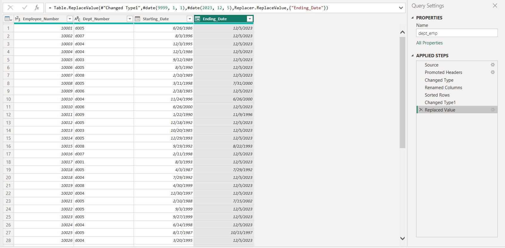

# POWER BI - An Amazing World of Visuals.

Image link: https://pixelplex.io/wp-content/uploads/2023/06/power-bi-data-visualization-main-1600.jpg

## INTRODUCTION
This is an Introduction to Power BI. As a data analyst, enthusiastic about learning and taking on projects, this shows the depth of my learning and progress. In my journey to Data Analysis, I have explored the world of queries through SQL and now, I explore the world of visualization through Microsoft Power BI. This is a task that connects my Power BI to an SQL database. The aim of this task is to show how Power BI can be connected to different sources and how data can be cleaned.

**_Disclaimer_** ⚠️- _All data used for this analysis are hypothetical data generated and do not represent any company's data or an attempt to endanger their performance._

## SKILLS DEMONSTRATED
This project shows how Power BI and SQL can be linked together by importing files SQL database into Power BI and filtering tables using SQL queries. Furthermore, data was cleaned and transformed using the power query editor. Skills Demonstrated include: 
- Importing files
- Connecting Power BI to external sources
- Data Cleaning and transformation using Power Query editor
- Conditional formating in Power Query
- Merging and appending queries

## DATA SOURCING
The data was provided in CSV format as a task and the details used were hypothetically generated.

## ANALYSIS

- In order to connect Power BI to my SQL Server, the file was imported into a newly created database on the SQL Server. 

- Power BI was launched and connected to the SQL database that was created on the server. A line of query was written to return the first 25 lines from our table in our SQL database.

- The first 25 rows were returned from the already connected SQL server database into our Power BI. 

- More tables were impoted directly into Power BI in Excel CSV format for cleaning and transformation.

                                                        |                                                
:------------------------------------------------------------------------:|:-------------------------------------------------------------------------------:

- The tables to be cleaned were now imported into our power query editor for proper wranglimg, cleaning and transformation.

- The tables are successfully cleaned by checking for null values and eliminating them, by properly formating our data types and column headers, by correcting wrong date formats and replacing with today's date.

                                              |                                             
:-------------------------------------------------------------------------:|:-----------------------------------------------------------------------------------:

- Finally, the four tables that were imported and cleaned using the power query editor were merged. The merging of these queries was found to be similar to JOINS functionality of SQL, using a common column to join the tables.

## CONCLUSION
Power BI is an amazing application and very interesting to use. Contionus learning and practice will make one better at it. As Aristotle said, "We are what we repeatedly do. Excellence, then, is not an act, but a habit." 

### **Thank You** 🥇

